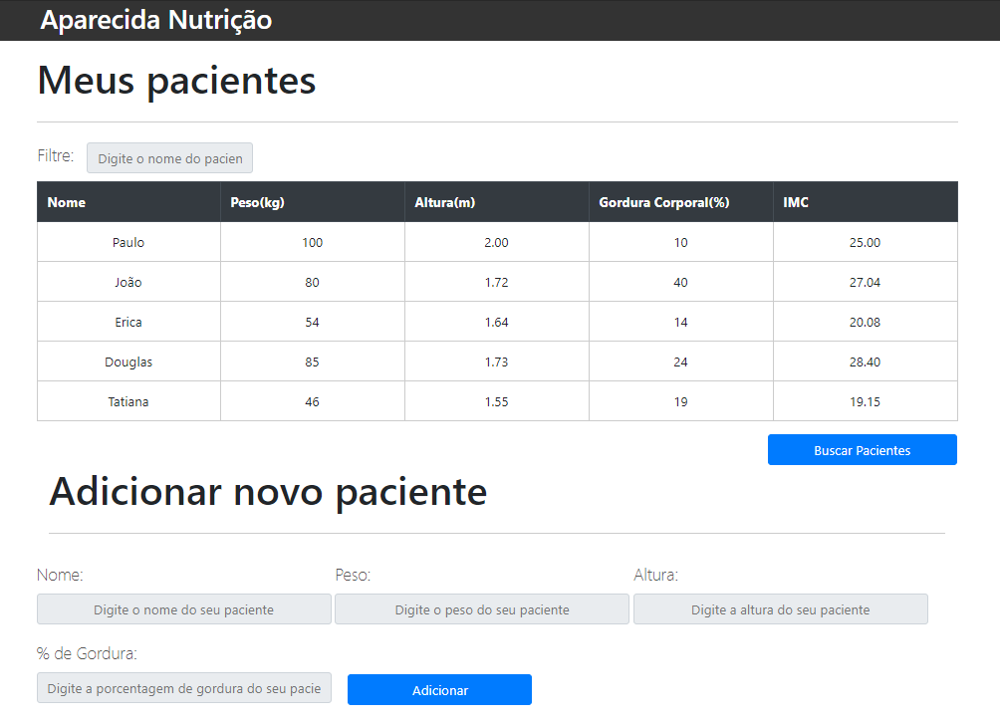

<h1  align="center">

 

</h1>

## This project was developed at [Alura Cursos](https://www.alura.com.br/) and presents the following chapters:

## :star: Chapter 1: Introduction

- Separate the organization of our code into .js files
- Import .js files always at the end of the body
- The representation of HTML by the document variable
- The querySelector () search function
- Prefer to select by #id or .class

## :star: Chapter 2: Variables and Operators

- The logical OR operator (||)
- The logical operator of E (&&)
- Search for elements

## :star: Chapter 3: Arrays, Loop and Styles

- How to select multiple elements with the querySelectorAll () functionThe logical OR operator (||)
- We recall a classic method of iteration with the for
- We saw how to manipulate styles with the .style property
- We saw that we should use camelCase when we want to modify a property that has two words, like background-color
- The good practice of not changing the style directly in Javascript, but modifying the element classes with the .classList property
-

## :star: Chapter 4: Events, Forms and Creating Elements

- The difference between named roles and anonymous roles
- Listening for browser events with the addEventListener () function
- That the element-creating function is .createElement ()
- Getting the value of an input through the .value property
- Accessing the inputs of a form through the _name_ property.
- Adding elements on the page and inside other elements with the appendChild () function

## :star: Chapter 5: Good practices with Javascript

- Divide the code, separating by system features
- Javascript objects
- Breaking large functions into smaller functions, with each one having its own responsibility
- The form.reset () function to clear the form

## :star: Chapter 6: Forms Validation

- More code organization, exporting the validation functions.
- The NOT (!) Negation operator
- How to validate a form
- The push function to place elements within an array
- The innerHTML property of the elements, which was used to delete the <ul> items
- The forEach method for traversing arrays

## :star: Chapter 7: Removal, Delegation and Animation

- The new dblclick event
- How events propagate through the page
- The delegation of events
- How to animate a removal with setTimeout

## :star: Chapter 8: Filtering a table

- The new input event
- The trick of making invisible by adding a class with display: none
- How to perform a search, hiding all the elements and showing only those that interest us
- How to search for just a piece of a word with Javascript Regular Expressions

## :star: Chapter 9: Searching AJAX patients

- How to make an asynchronous request with Javascript
- The XMLHttpRequest object
- How to set up and send a request
- The load event
- What is the AJAX technique.
- The JSON format
- How to convert JSON to a Javascript object with the JSON.parse () function
- Handling errors during AJAX
